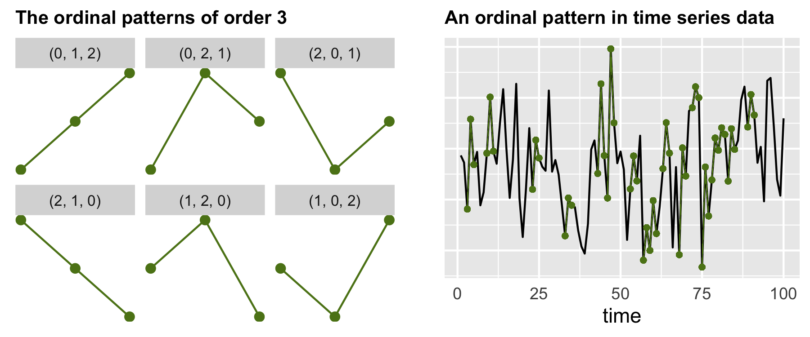

I am an assistant professor at Twente University. I mainly work on Time Series Analysis and, more recently,  started working on Transfer Learning.

<!--- Add more cv--->

__ROBUST METHODS FOR TIME SERIES ANALYSIS__

<!--- From the daily values of stock indices to the minutely recorded number of your heart beats: time series, i.e. timely-ordered sequences of correlated observations, appear everywhere. Their analysis becomes increasingly important due to the massive production of data through, e.g. the internet of things or the digitalization of healthcare.--->

My research focuses on robust methods for time series analysis, i.e. on statistical techniques that are designed to handle data that contains outliers, structural changes, or other types of deviations from the expected patterns. Traditional time series analysis methods can be sensitive to such deviations and may produce inaccurate results. Robust methods aim to overcome this limitation by identifying and downweighting the influence of anomalies, while still preserving the overall structure of the time series. Ordinal patterns, which represent the spatial ordering of consecutive values in a time series, constitute one example of such methods.

__TRANSFER LEARNING__

Transfer learning is a machine learning paradigm that leverages knowledge gained from solving one task and applies it to a different but related task. In traditional machine learning, models are trained from scratch for a specific task with a designated dataset. However, transfer learning allows pre-trained models, often developed on large and diverse datasets, to be adapted for new tasks with smaller datasets. This approach is particularly beneficial when labeled data for the target task is limited or expensive to obtain. By transferring knowledge learned from a source domain to a target domain, transfer learning accelerates the training process and enhances the performance of models on new tasks. 

<!---  Imagine that $x\in\mathcal{X}$ represents symptoms of a disease and that the label
 $y\in \mathcal{Y}$ indicates whether a person has been infected with the disease.
 Moreover, assume that the distributions $P$ and $Q$ defined on $\mathcal{X}\times \mathcal{Y}$ correspond to the joint distribution of symptoms and infections in different hospitals, e.g. in different locations, that adopt distinct prevention and control measures so that the disease prevalence differs, i.e. $p(y) \neq q(y)$.
  At the same time, 
it is reasonable to assume  that the symptoms of the disease and the mechanism that symptoms caused by diseases are the same in both places, 
i.e. $p(x|y) = q(x|y)$. 
To make a diagnostic model based on data from one of the hospitals work in the  other hospital it becomes therefore crucial to study label shift adaptation.--->
